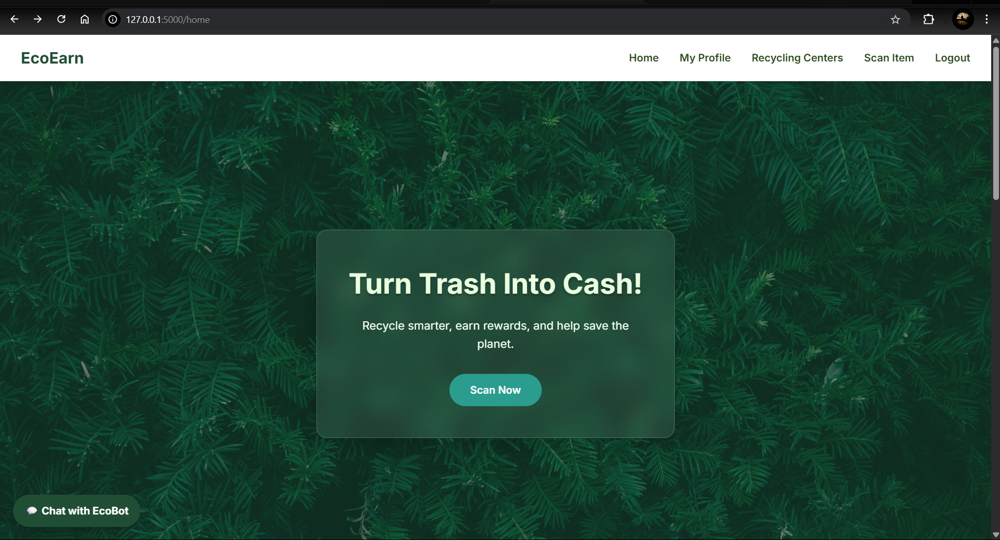
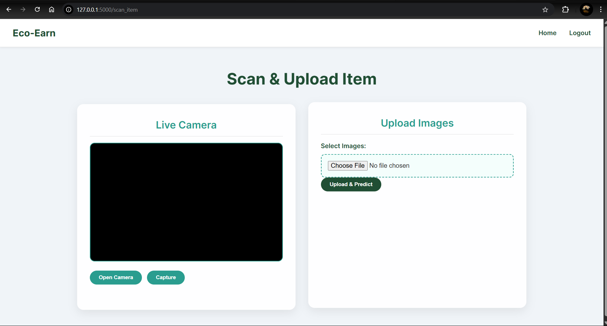
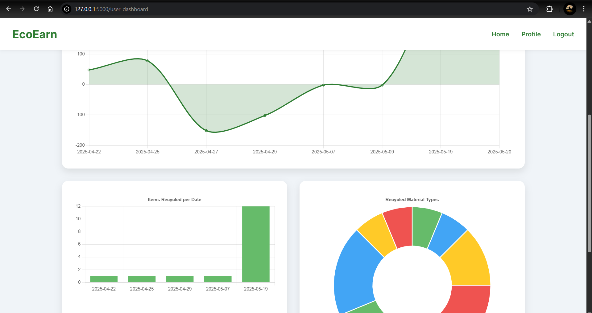
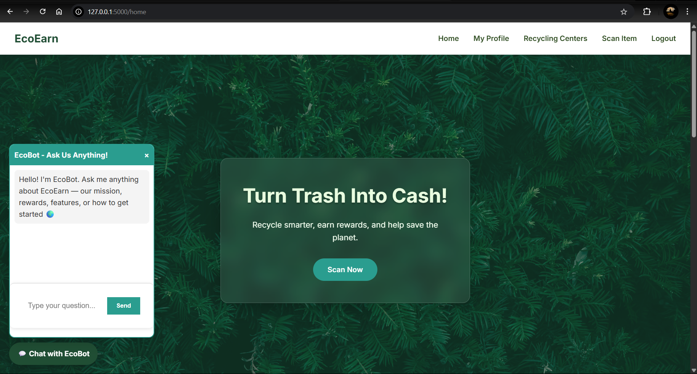

# Eco‑Earn ♻️

**Turn trash into cash — recycle smarter, earn rewards, and track your impact.**

> A full‑stack Flask + MongoDB web platform that lets users scan recyclable items, locate nearby recycling centers, and collect reward points while administrators manage centers, announcements, and platform data.

[](LICENSE)    

---

## Table of Contents

1. [Features](#features)
2. [Screenshots](#screenshots)
3. [Tech Stack](#tech-stack)
4. [Quick Start](#quick-start)
5. [Project Structure](#project-structure)
6. [Roadmap](#roadmap)
7. [Contributing](#contributing)
8. [License](#license)
9. [Acknowledgements](#acknowledgements)

---

## Features

* **User Authentication** — secure signup/login with BCrypt‑hashed passwords and Flask sessions.
* **Item Scanning** — upload images *or* capture live photos with a mobile‑friendly camera overlay.
* **Geospatial Center Lookup** — MongoDB `$near` query finds recycling centers within 50 km and renders them on Leaflet maps.
* **Rewards & Stats** — each scan credits the user; dashboard shows items recycled, rewards earned, and environmental impact.
* **Admin Dashboard** — CRUD for users, centers, items, transactions, and announcements.
* **Responsive UI** — clean CSS, mobile‑first layouts, dark navbar, card‑style components.
* **NoSQL Data Model** — flexible MongoDB collections (`users`, `recyclingCenters`, `transactions`, `announcements`, …) ready for scaling.

---

## Screenshots
> Add PNG/JPGs (≤1 MB) to `docs/screenshots/` and the previews will render automatically.

| Home Page | Center Map | Scan Item |
|:---:|:---:|:---:|
|  |  |  |

| User Dashboard | Signup Page | Leaderboard |
|:---:|:---:|:---:|
|  |  |  |

---
## Tech Stack

| Layer               | Technology                                                |
| ------------------- | --------------------------------------------------------- |
| **Backend**         | Python 3.10, Flask 2.x, Werkzeug, Flask‑Bcrypt            |
| **Database**        | MongoDB 6 (NoSQL, geospatial index)                       |
| **Frontend**        | Vanilla JS (ES6), HTML5, CSS3, Leaflet 1.7, FontAwesome 6 |
| **Auth & Security** | Sessions, BCrypt hashing, flashed messages                |
| **Dev Ops**         | pip + requirements.txt, virtualenv, dotenv for secrets    |

---

## Quick Start

```bash
# 1  Clone
$ git clone https://github.com/your‑username/Eco‑Earn.git && cd Eco‑Earn

# 2  Create virtual env & install deps
$ python -m venv venv && source venv/bin/activate   # Windows: venv\Scripts\activate
$ pip install -r requirements.txt

# 3  Configure environment variables (create .env)
SECRET_KEY=changeme123
MONGO_URI=mongodb://localhost:27017/ecoearn

# 4  Run MongoDB (local)
$ mongod --dbpath /path/to/data &

# 5  Seed a test admin (optional)
$ python scripts/create_admin.py  # tiny helper CLI

# 6  Start Flask dev server
$ flask run  # open http://127.0.0.1:5000
```

### Environment Variables

| Key                              | Purpose                       |
| -------------------------------- | ----------------------------- |
| `MONGO_URI`                      | Connection string for MongoDB |
| `SECRET_KEY`                     | Flask session signing key     |
| *(future)* `GOOGLE_MAPS_API_KEY` | If switching to Google tiles  |

---

## Project Structure

```
Eco‑Earn/
├─ app.py               # main Flask routes & logic
├─ config.py            # DB_URL constant
├─ requirements.txt
├─ static/
│  ├─ css/ styles.css
│  ├─ js/  camera.js, map.js, center_map.js, admin.js
│  ├─ uploads/          # user‑uploaded images
│  └─ images/ default assets
├─ templates/           # Jinja2 HTML templates
│  ├─ *.html            # home, scan_item, admin_*, etc.
├─ docs/
│  └─ screenshots/      # README images
└─ README.md            # you’re here
```

---

## Roadmap

* [ ] Integrate AI classification (e.g., LLaVA) to auto‑detect item type and value.
* [ ] Reward redemption gateway (gift cards / PayTM).
* [ ] Progressive Web App (installable, offline queue for scans).
* [ ] Docker compose for one‑command local setup.
* [ ] Unit + integration tests (PyTest).

---

## Contributing

1. **Fork** the repo & create your branch: `git checkout -b feat/my‑feature`.
2. **Commit** your changes: `git commit -m "Add amazing feature"`.
3. **Push**: `git push origin feat/my‑feature`.
4. **Open a Pull Request** describing your changes.

Follow PEP 8 for Python, 2‑space indentation in HTML/CSS/JS, and keep PRs small & focused.

---

## License

This project is licensed under the **MIT License** — see [`LICENSE`](LICENSE) for details.

---

## Acknowledgements

* [Flask](https://flask.palletsprojects.com/) — micro‑framework that powers the backend.
* [MongoDB](https://www.mongodb.com/) — NoSQL database with geospatial queries.
* [Leaflet](https://leafletjs.com/) & [OpenStreetMap](https://www.openstreetmap.org/) — free interactive maps.
* Icons by [Font Awesome](https://fontawesome.com/).
* Photo assets from [Unsplash](https://unsplash.com/)
